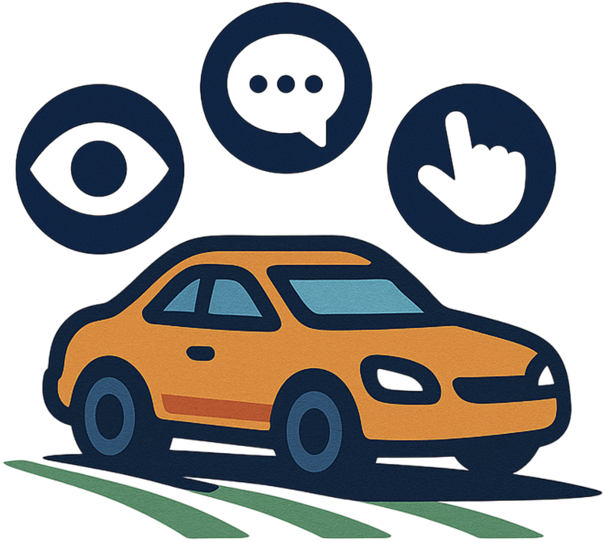

#  AutoVLA

[](https://autovla.github.io/)
[](https://arxiv.org/abs/2506.13757)
[]()
<!-- [](https://creativecommons.org/licenses/by-nc-nd/4.0/) -->

<!-- This is the official implementation for the following paper: -->

[**AutoVLA: A Vision-Language-Action Model for End-to-End Autonomous Driving with Adaptive Reasoning and Reinforcement Fine-Tuning**](https://arxiv.org/abs/2506.13757)

[Zewei Zhou](https://zewei-zhou.github.io/)\*</sup>, [Tianhui Cai](https://www.tianhui-vicky.com/)\*</sup>, [Seth Z. Zhao](https://sethzhao506.github.io/), [Yun Zhang](https://handsomeyun.github.io/), [Zhiyu Huang](https://mczhi.github.io/)<sup>†</sup>, [Bolei Zhou](https://boleizhou.github.io/), [Jiaqi Ma](https://mobility-lab.seas.ucla.edu/about/)

University of California, Los Angeles - <sup>*</sup> Equal contribution, <sup>†</sup> Project leader


- AutoVLA integrates **chain-of-thought reasoning** and **physical action tokenization** to directly generate planning trajectories through a unified autoregressive process, dynamically switching dual-thinking modes.
- **Supervised fine-tuning (RFT)** is employed to equip the model with dual thinking modes: fast thinking (trajectory-only) and slow thinking (enhanced with chain-of-thought reasoning). 
- **Reinforcement fine-tuning (RFT)** based on Group Relative Policy Optimization (GRPO) is adopted to further enhance planning performance and efficiency, reducing unnecessary reasoning in straightforward scenarios.
- Extensive experiments across real-world and simulated datasets and benchmarks, including **nuPlan**, **nuScenes**, **Waymo**, and **CARLA**, demonstrate its competitive performance in both open-loop and closed-loop settings. 

<!-- Supported by the [UCLA Mobility Lab](https://mobility-lab.seas.ucla.edu/) -->

<!-- ## Overview
- [Codebase Features](#codebase-features)
- [Release Plan](#release-plan)
- [Dataset](#dataset)
- [Acknowledgment](#acknowledgement)
- [Citation](#citation) -->

## News
- **`2025/06`**: [AutoVLA](https://arxiv.org/abs/2506.13757) paper release
- **`2025/05`**: In the [Waymo Vision-based End-to-end Driving Challenge](https://waymo.com/open/challenges/2025/e2e-driving/), AutoVLA ranks highly in both RFS Overall and achieves the top RFS Spotlight score, which focuses on the most challenging scenarios.

## TODO List
- [x] AutoVLA paper.
- [ ] Reasoning data.
- [ ] Reasoning annotation code.
- [ ] AutoVLA code.
- [ ] AutoVLA checkpoints.

## Citation
If you find this repository useful for your research, please consider giving us a star 🌟 and citing our paper.
 ```bibtex
@article{zhou2025autovla,
  title={AutoVLA: A Vision-Language-Action Model for End-to-End Autonomous Driving with Adaptive Reasoning and Reinforcement Fine-Tuning},
  author={Zhou, Zewei and Cai, Tianhui and Zhao, Seth Z.and Zhang, Yun and Huang, Zhiyu and Zhou, Bolei and Ma, Jiaqi},
  journal={arXiv preprint arXiv:2506.13757},
  year={2025}
}